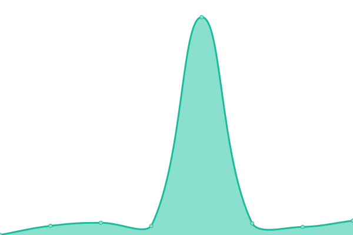
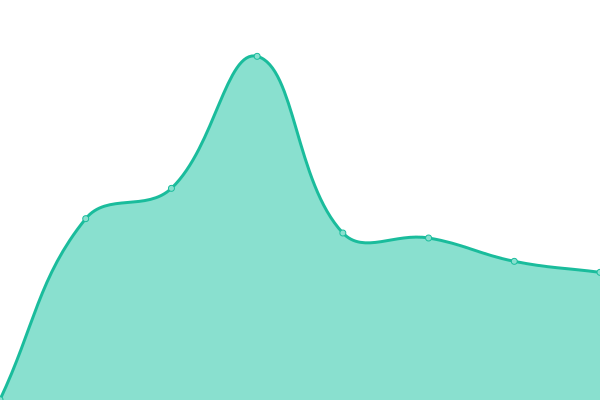
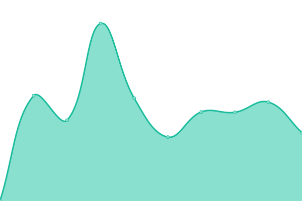
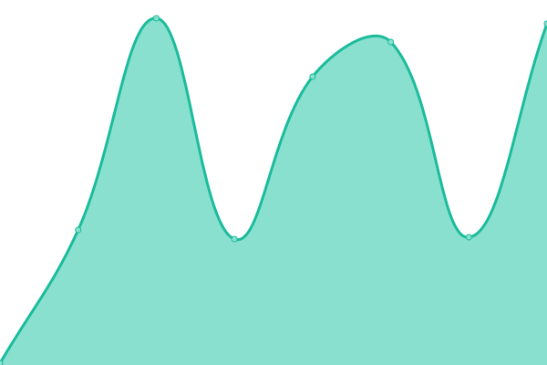

# [📈 Live Status](https://Oktyz.github.io/upptime): <!--live status--> **🟩 All systems operational**

This repository contains uptime monitor and status page by [Oktyz](https://Oktyz.github.io/upptime), powered by [Upptime](https://github.com/upptime/upptime).

With [Upptime](https://upptime.js.org), you can get your own unlimited and free uptime monitor and status page, powered entirely by a GitHub repository. We use [Issues](https://github.com/Oktyz/upptime/issues) as incident reports, [Actions](https://github.com/Oktyz/upptime/actions) as uptime monitors, and [Pages](https://Oktyz.github.io/upptime) for the status page.

<!--start: status pages-->
<!-- This summary is generated by Upptime (https://github.com/upptime/upptime) -->
<!-- Do not edit this manually, your changes will be overwritten -->
<!-- prettier-ignore -->
| URL | Status | History | Response Time | Uptime |
| --- | ------ | ------- | ------------- | ------ |
|  [Google](https://www.google.com) | 🟩 Up | [google.yml](https://github.com/Oktyz/upptime/commits/HEAD/history/google.yml) | 

 87ms
     
 | 

<a href="https://Oktyz.github.io/upptime/history/google">100.00%</a>
    

|  [Cloudflare](https://cloudflare.com) | 🟩 Up | [cloudflare.yml](https://github.com/Oktyz/upptime/commits/HEAD/history/cloudflare.yml) | 

 878ms
     
 | 

<a href="https://Oktyz.github.io/upptime/history/cloudflare">100.00%</a>
    

|  [Spotify](https://open.spotify.com/) | 🟩 Up | [spotify.yml](https://github.com/Oktyz/upptime/commits/HEAD/history/spotify.yml) | 

 495ms
     
 | 

<a href="https://Oktyz.github.io/upptime/history/spotify">100.00%</a>
    

|  [Facebook](https://facebook.com) | 🟩 Up | [facebook.yml](https://github.com/Oktyz/upptime/commits/HEAD/history/facebook.yml) | 

 624ms
     
 | 

<a href="https://Oktyz.github.io/upptime/history/facebook">100.00%</a>
    

|  [Instagram](https://instagram.com) | 🟩 Up | [instagram.yml](https://github.com/Oktyz/upptime/commits/HEAD/history/instagram.yml) | 

 897ms
     
 | 

<a href="https://Oktyz.github.io/upptime/history/instagram">99.84%</a>
    

|  [Github](https://github.com) | 🟩 Up | [github.yml](https://github.com/Oktyz/upptime/commits/HEAD/history/github.yml) | 

 227ms
     
 | 

<a href="https://Oktyz.github.io/upptime/history/github">100.00%</a>
    

<!--end: status pages-->

[**Visit our status website →**](https://Oktyz.github.io/upptime)

## 📄 License

- Powered by: [Upptime](https://github.com/upptime/upptime)
- Code: [MIT](./LICENSE) © [Anand Chowdhary](https://anandchowdhary.com), supported by [Pabio](https://pabio.com)
- Data in the `./history` directory: [Open Database License](https://opendatacommons.org/licenses/odbl/1-0/)
